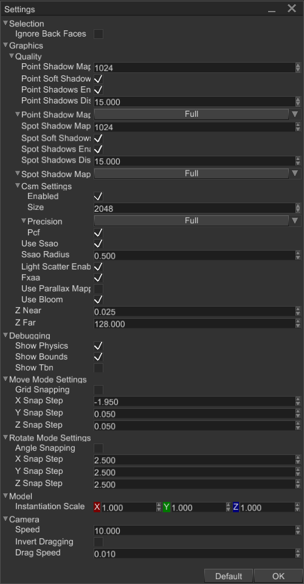

# Settings

This chapter should help you to have better understanding of how to configure the editor and which settings 
are responsible for what.

## Selection

This section contains options for objects selection.

- `Ignore Back Faces` - if set, forces mouse picking to ignore back faces of triangles, allowing you to "click-thru" 
triangles from back side. It is useful to pick objects in scenes where you have a ceiling, if the ceiling is one-sided,
then all clicks will pass through it allowing you to select objects below the ceiling.

## Graphics

Options in this section defines quality settings for rendering. It directly affects performance and can be used to
see how well your scene will be rendered with different options. Almost everything in this section is very well 
covered in [Quality Settings section](../rendering/settings.md). The rest of the fields described below.

- `Z Near` - defines near clipping plane for main preview camera in the scene.
- `Z Far` - defines far clipping plane for main preview camera in the scene.

## Debugging

This section contains options for visual debugging, it helps you to see invisible geometry, such as bounding boxes,
physical objects, etc.

- `Show Physics` - if set, shows physical entities in wireframe mode using debug renderer. It is useful to see where
physical entities are, and what shape they have.
- `Show Bounds` - if set, shows bounding boxes of scene nodes.
- `Show Tbn` - if set, shows tangent-binormal-normal basis of every mesh in the scene. It can be useful to debug 
graphical issues related to incorrect tangent space.

## Move Mode Settings

Options in this section responsible for behaviour of Move interaction mode (a tool that allows you to move a node
with a gizmo).

- `Grid Snapping` - if set, restricts movement to a 3D grid nodes with axes steps defined by Snap Step parameter
for respective axis.
- `X/Y/Z Snap Step` - defines snapping step (in meters) on respective axis.  

## Rotate Mode Settings

This section contains options for Rotate interaction mode (a tool that allows you to rotate a node with a gizmo).

- `Angle Snapping` - if set, restricts rotation around each axis to a series of marks with uniform
angular step added to imaginary dial.
- `X/Y/Z Snap Step` - defines snapping step (in radians) around respective axis.

## Model

Options in this section affects how the editor handles [Model](../resources/model.md) assets.

- `Instantiation Scale` - defines a scale that will be applied to a root node of every Model resource being instantiated
in the editor. It is useful if you have tons of Model resources that are either too large or too small, and you want 
to re-scale them automatically.

## Camera

This section contains options of editor camera that is used in Scene Preview window. 

- `Speed` - speed of camera in meters per second.
- `Invert Dragging` - if set, inverts dragging of the camera via middle mouse button.
- `Drag Speed` - defines how fast the camera will move while being dragged via middle mouse button.