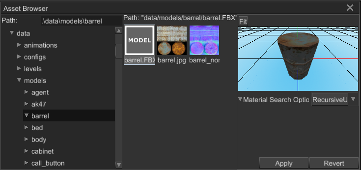

# Model resources

## Supported formats

I3M supports these file formats for 3D models:

- FBX - standard game development industry 3D model exchange format
- RGS - native scenes format produced by I3M (the editor)

The list could be extended in the future.

## Instantiation

Model must be instantiated in your scene, there is no other way of using it. To do this, you can either use drag'n'drop
from Asset Browser in the editor or instantiate the model dynamically from code:

```rust,no_run,edition2018
{{#include ../code/snippets/src/resource/model.rs:instantiate_model}}
```

## Material import

The engine tries to import materials as close as possible to originals in the model, however it is not always possible
because some 3D modelling software could use different shading models. By default, the engine tries to convert
everything to PBR materials, so if you have a 3D model with a special material made for cartoon shading, the
engine will still import it as PBR material (with lots of missing textures of course). You should take this into
account when working with something other than PBR materials. 

In cases when your 3D model have some weird materials, you should create appropriate materials and shaders _manually_,
the engine is not a magic tool, it has some defaults that do not cover all possible cases.

It is also possible to specify how to resolve textures while loading a 3D model, select your model in the `Asset Browser`
and there will be import options right below the model preview:



It is also possible to specify such options manually. To do that, you need to create import options file with the 
following content near your 3D model (this is what the editor does for you):

```text
(
    material_search_options: RecursiveUp
)
```

The file must have the `.options` additional extension. For example, if you have a `foo.fbx` model, the options
file should have `foo.fbx.options` name. Even if it is possible to modify it by hand, it is strongly advised to use
the editor to edit import options, because it reduces the chance of messing up.

## Tips for Blender

Blender's FBX exporter has exporting scale properties usually set to 100%, this may lead to incorrect scale
of your model in the engine. It will have `(100.0, 100.0, 100.0)` scale which is very huge. To fix that, set
the scale in the exporter to `0.01`.

## Tips for 3Ds Max

Latest versions of 3Ds max have node-based material editor which creates some "junk" nodes which may mess up
material import. To prevent any issues with that, you should clean all assignments to material slots to use
maps directly.