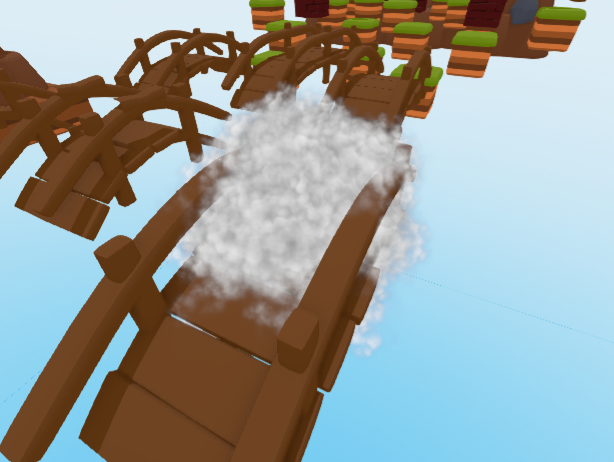
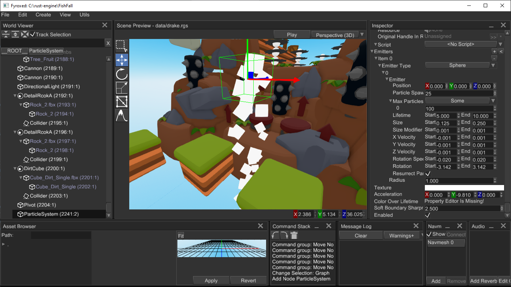
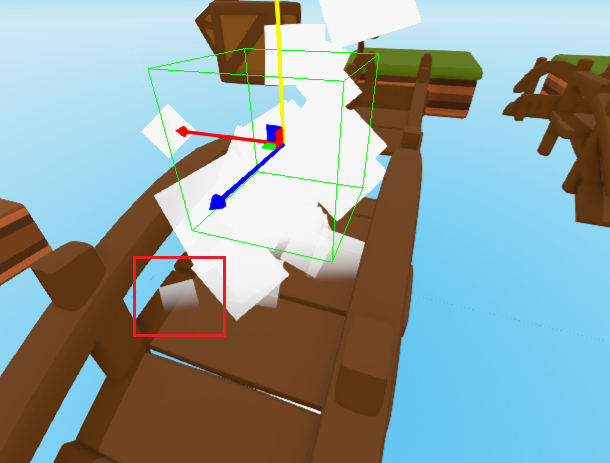

# Particle system 

Particle system is a scene node that is used to create complex visual effects (VFX). It operates on huge amount
of particles at once allowing you to do complex simulation that involves large amount of particles. Typically,
particle systems are used to create following visual effects: smoke, sparks, blood splatters, steam, etc. 



## Basic Concepts

Particle system uses _single_ texture for every particle in the system, only Red channel is used. Red channel interpreted
as an alpha for all particles.

Every particle is affected by `Acceleration` parameters of the particle system. It defines acceleration 
(in m/s<sup>2</sup>) that will affect velocities of every particle. It is used to simulate gravity.

### Particle

Particle is a square (not quadrilateral, this is important) with a texture which is always facing towards camera. It
has the following properties:

- `Position` - defines a position in _local_ coordinates of particle system (this means that if you rotate a particle
system, all particles will be rotated too).
- `Velocity` - defines a speed vector (in local coordinates) that will be used to modify local position of the particle 
each frame.
- `Size` - size (in meters) of the square shape of the particle.
- `Size Modifier` - a numeric value (in meters per second), that will be added to the Size at each frame, it is used 
to modify size of the particles.
- `Lifetime` - amount of time (in seconds) that the particle can be active for.
- `Rotation` - angle (in radians) that defines rotation around particle-to-camera axis (clockwise).
- `Rotation Speed` - speed (in radians per second, rad/s) of rotation of the particle.
- `Color` - RGBA color of the particle.

### Emitters

Particle system uses _emitters_ to define a set of zones where particles will be spawned, it also defines initial ranges of 
parameters of particles. Particle system must have at least one emitter to generate particles. 

Emitter can be one of the following types:

- `Cuboid` - emits particles uniformly in a cuboid shape, the shape cannot be rotated, only translated.
- `Sphere` - emits particles uniformly in a sphere shape.
- `Cylinder` - emits particle uniformly in a cylinder shape, the shape cannot be rotated, only translated.

Each emitter have fixed set of parameters that affects _initial_ values for every spawned particle:

- `Position` - emitter have its own _local_ position (position relative to parent particle system node), this helps you
to create complex particle systems that may spawn particles from multiple zones in space at once.
- `Max Particles` - maximum amount of particles available for spawn. By default, it is `None`, which says that there is 
no limit.
- `Spawn Rate` - rate (in units per second) defines how fast the emitter will spawn particles.
- `Lifetime Range` - numeric range (in seconds) for particle lifetime values. The lower the beginning of the range
the less spawned particles will live, and vice versa.
- `Size Range` - numeric range (in meters) for particle size.
- `Size Modifier Range` - numeric range (in meters per second, m/s) for particle size modifier parameter.
- `X/Y/Z Velocity Range` - a numeric range (in meters per second, m/s) for a respective velocity axis (X, Y, Z) 
that defines initial speed along the axis.
- `Rotation Range` - a numeric range (in radians) for initial rotation of a new particle.
- `Rotation Speed Range` - a numeric range (in radians per second, rad/s) for rotation speed of a new particle.

**Important:** Every range (like Lifetime Range, Size Range, etc.) parameter generates _random_ value for respective 
parameter of a particle. You can tweak the seed of current random number generator (`i3m::core::thread_rng()`) to
ensure that generated values will be different each time.

## How to create

There are multiple ways of creating a particle system, pick one that best suits your current needs.

### Using the editor

The best way to create a particle system is to configure it in the editor, creating from code is possible too (see below),
but way harder and may be not intuitive, because of the large amount of parameters. The editor allows you see the result 
and tweak it very fast. Create a particle system by `Create -> Particle System` and then you can start editing its 
properties. By default, new particle system has one Sphere particle emitter, you can add new emitters by clicking `+` 
button at the right of `Emitters` property in the Inspector (or remove by clicking `-`). Here's a simple example:



Now start tweaking desired parameters, it is hard to give any recommendations of how to achieve a particular effect,
only practice matters here.

### Using the code

You can also create particle systems from code (in case if you need some procedurally-generated effects):

```rust,no_run
{{#include ../code/snippets/src/scene/particle_system.rs:create_smoke}}
```

This code creates smoke effect with smooth dissolving (by using color-over-lifetime gradient). Please refer to
[API docs](https://docs.rs/i3m/latest/i3m/scene/particle_system/index.html) for particle system for more information. 

### Using prefabs

If you need to create particle systems made in the editor, you can always use prefabs. Create a scene with desired
particle system and then [instantiate](../resources/model.md#instantiation) it to your scene.

## Soft particles

I3M used special technique, called soft particles, that smooths sharp transitions between particles and scene geometry: 



This technique especially useful for effects such as smoke, fog, etc. where you don't want to see the "edge" between 
particles and scene geometry. You can tweak this effect using `Soft Boundary Sharpness Factor`, the larger the value
the more "sharp" the edge will be and vice versa.

## Restarting emission

You can "rewind" particle systems in the "initial" state by calling `particle_system.clear_particles()` method, it 
will remove all generated particles and emission will start over.

## Enabling or disabling particle systems

By default, every particle system is enabled. Sometimes there is a need to create a particle system, but not enable
it (for example for some delayed effect). You can achieve this by calling `particle_system.set_enabled(true/false)` 
method. Disabled particle systems will still be drawn, but emission and animation will be stopped. To hide particle
system completely, use `particle_system.set_visibility(false)` method.

## Performance 

Particle systems using special renderer that optimized to draw millions of particles with very low overhead, however
particles simulated on CPU side and may significantly impact overall performance when there are many particle systems
with lots of particles in each.

## Limitations

Particle systems does not interact with lighting, this means that particles will not be lit by light sources in the scene.

