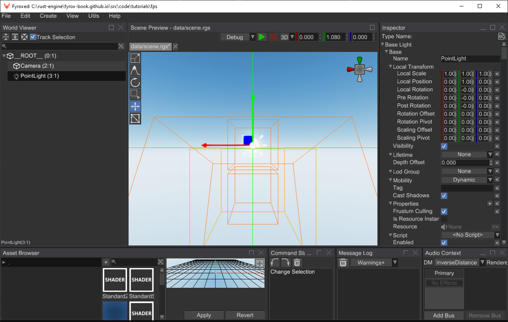
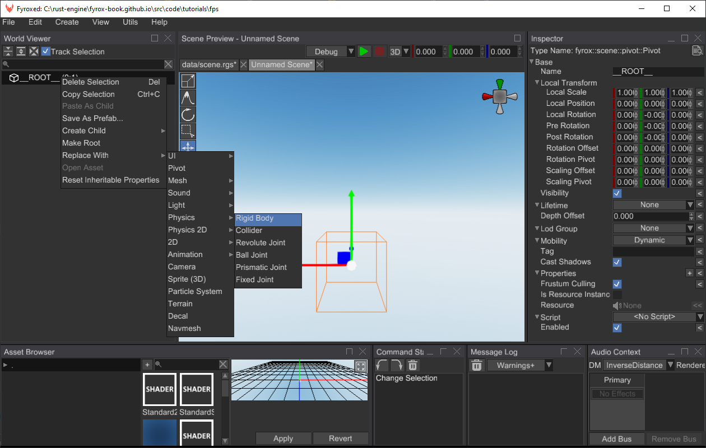
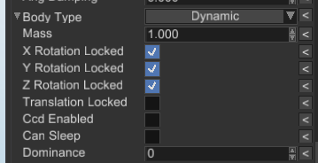
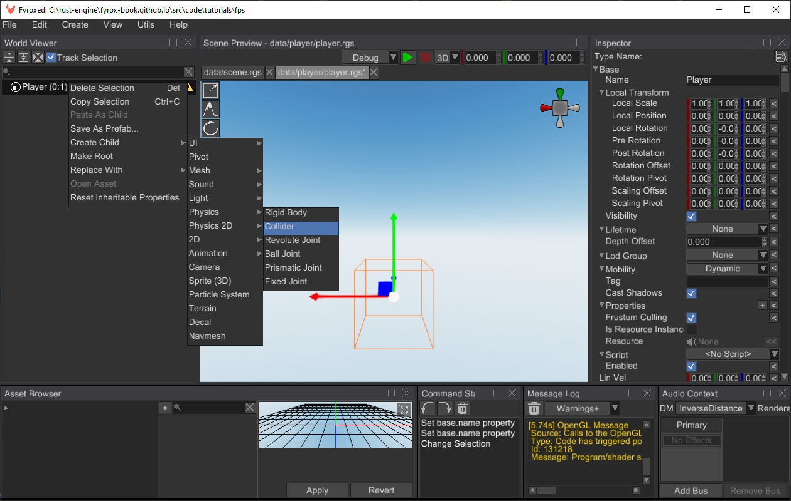
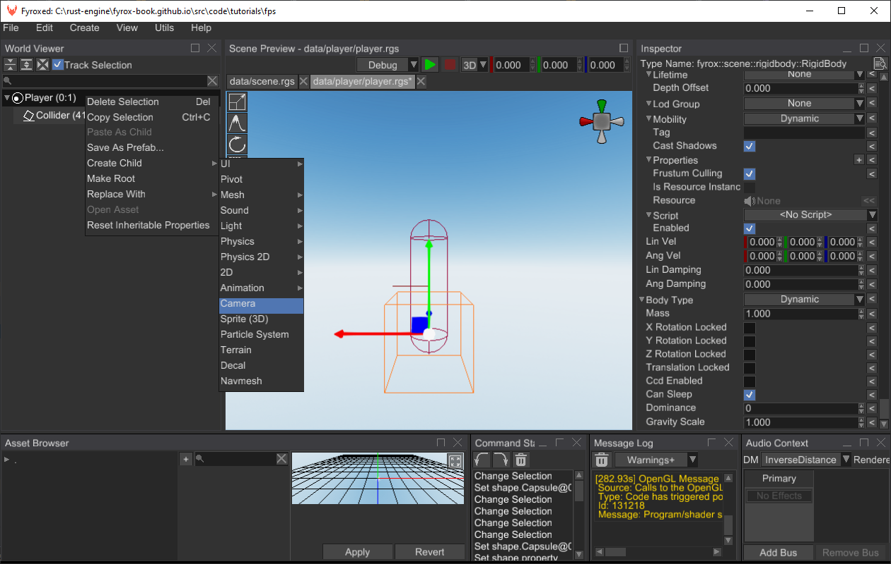
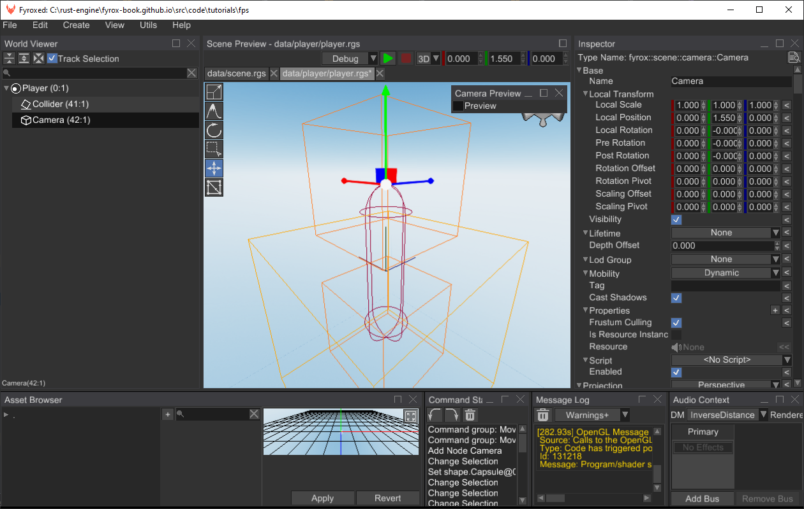
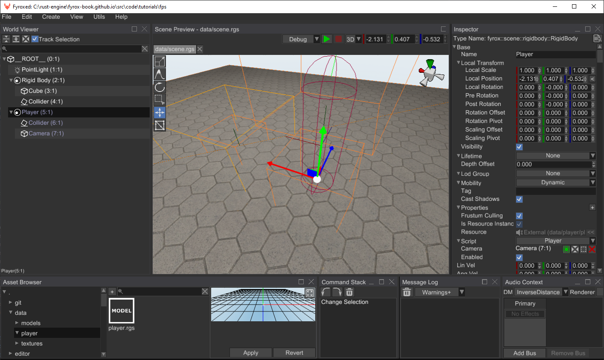
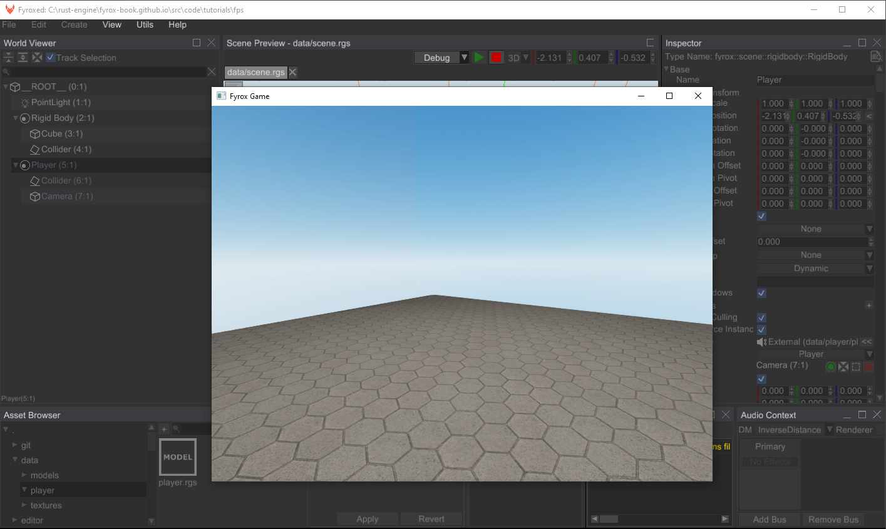

# First-Person Shooter Tutorial

In this tutorial, we'll create a first-person shooter game. 

Before we begin, make sure you know how to create projects and run the game and the editor. Read 
[this chapter](../../../beginning/scripting.md) first and let's start by creating a new project by executing the following 
command in some directory:

```shell
i3m-template init --name=fps --style=3d
```

This command will create a new cargo workspace with a few projects inside, we're interested only in `game` folder
in this tutorial.


```text
fps
├───data
├───editor
│   └───src
├───executor
│   └───src
├───executor-android
│   └───src
├───executor-wasm
│   └───src
└───game
    └───src
```

## Player Prefab

Let's start by creating a [prefab](../../../scene/prefab.md) for the player. First-person shooters use quite simple 
layouts for characters - usually, it is just a physical capsule with a camera on top of it. Run the editor using the 
following command:

```shell
cargo run --package editor
```



By default, `scene.rgs` scene is loaded, and it is our main scene, but for our player prefab we need a separate scene.
Go to `File` menu and click `New Scene`. Save the scene in `data/player` folder as `player.rgs`. 

Great, now we are ready to create the prefab. Right-click on the `__ROOT__` node in the World Viewer and find `Replace Node` 
and select `Physics -> Rigid Body` there. By doing this, we've replaced the root node of the scene to be a rigid body. 
This is needed because our player will be moving.



Select rigid body and set the `X/Y/Z Rotation Locked` properties to `true`, `Can Sleep` - to `false`. The first three
properties prevents the rigid body from any undesired rotations and the last one prevents the rigid body from being excluded
from simulations.



As you may notice, the editor added a small "warning" icon near the root node - it tells us that the rigid body does not
have a collider. Let's fix that:



By default, the editor creates a cube collider, but we need a capsule. Let's change that in the Inspector:


Now let's change the size of the collider, because default values are disproportional for a humanoid character:


This way the capsule is thinner and taller, which roughly corresponds to a 1.8m tall person. Now we need to add a 
[camera](../../../scene/camera_node.md), because without it, we couldn't see anything. 



Put the camera at the top of the capsule like so:



Awesome, at this point we're almost done with this prefab. Save the scene (`File -> Save Scene`) and let's start writing
some code.

## Code

Now we can start writing some code, that will drive our character. Game logic is located in [scripts](../../../scripting/script.md).
Navigate to the `fps` directory and execute the following command there:

```shell
i3m-template script --name=player
```

This command creates a new script for our player in `game/src` folder. Next, Replace the imports in the `lib.rs` with the ones below:
```rust
{{#include ../../../code/tutorials/fps/game/src/snips/lib.rs:player_imports}}
```

and then add the new module to the `lib.rs` module by adding the `pub mod player;` after the imports:

```rust
{{#include ../../../code/tutorials/fps/game/src/snips/lib.rs:player_mod_reg}}
```

All scripts must be registered in the engine explicitly, otherwise they won't work. To do that, add the following
lines to the `register` method:

```rust
{{#include ../../../code/tutorials/fps/game/src/lib.rs:player_script_reg}}
```

Great, now the new script is registered, we can head over to the `player.rs` module and start writing a basic character controller.
First replace the import to the following:

```rust
{{#include ../../../code/tutorials/fps/game/src/snips/player.rs:player_imports}}
```


 Let's start by input
handling. At first, add the following fields to the `Player` struct:

```rust
{{#include ../../../code/tutorials/fps/game/src/player.rs:input_fields}}
```

The first four fields are responsible for movement in four directions and the last two responsible for camera rotation.
The next thing that we need to do is properly react to incoming OS events to modify the variables that we've just 
defined. Add the following code to the `on_os_event` method like so:

```rust
{{#include ../../../code/tutorials/fps/game/src/player.rs:on_os_event}}
```

This code consists from two major parts:

- Raw mouse input handling for camera rotations: we're using horizontal movement to rotate the camera around vertical
axis and vertical mouse movement is used to rotate the camera around horizontal axis.
- Keyboard input handling for movement.

This just modifies the internal script variables, and basically does not affect anything else.

Now let's add camera rotation, at first we need to know the camera handle. Add the following field to the `Player` struct:

```rust
{{#include ../../../code/tutorials/fps/game/src/player.rs:camera_field}}
```

We'll assign this field later in the editor, for let's focus on the code. Add the following piece of code at the start of
the `on_update`:

```rust
{{#include ../../../code/tutorials/fps/game/src/player.rs:camera_rotation}}
```

This piece of code is relatively straightforward: at first we're trying to borrow the camera in the scene graph using 
its handle, if it is succeeded, we form two quaternions that represent rotations around Y and X axes and combine them 
using simple multiplication. 

Next thing we'll add movement code. Add the following code to the end of `on_update`:

```rust
{{#include ../../../code/tutorials/fps/game/src/player.rs:on_update_begin}}
{{#include ../../../code/tutorials/fps/game/src/player.rs:on_update_end}}
```

This code is responsible for movement when any of WSAD keys are pressed. At first, it tries to borrow the node to which
this script is assigned to, then it checks if any of the WSAD keys are pressed, and it forms a new velocity vector using
the basis vectors of node. As the last step, it normalizes the vector (makes it unity length) and sets it to the rigid
body velocity.


Our script is almost ready, now all we need to do is to assign it to the player's prefab. Open the `player.rgs` prefab
in the editor, select `Player` node and assign the Player script to it. Do not forget to set Camera handle (by clicking
on the small green button and selecting Camera from the list):


Great, now we're done with the player movement. We can test it our main scene, but at first let's create a simple level.
Open `scene.rgs` and create a rigid body with a collider. Add a cube as a child of the rigid body and squash it to some
floor-like shape. Select the collider and set its `Shape` to `Trimesh`, add a geometry source there and point it to the 
floor. Select the rigid body and set its type to `Static`. You can also add some texture to the cube to make it look
much better.

Now we can instantiate our player prefab in the scene. To do that, find the `player.rgs` in the Asset Browser, click
on it, hold the button, move the mouse over the scene and release the button. After that the prefab should be instantiated
at the cursor position like so:



After that you can click `Play` button (green triangle above the scene preview) and you should see something like this:



It should be possible to walk using WSAD keys and rotate the camera using mouse.

## Conclusion

In this tutorial we've created a basic character controller, that allows you to move using keyboard and look around 
using mouse. This tutorial showed the main development strategies used in the engine, that should help you to build your 
own game. In the next tutorial we'll add weapons. 